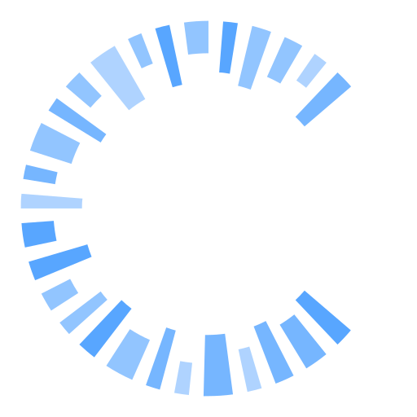

  
  
  ### Hi Hallo سلام 😊👋
  
  

  
  <a href="https://github.com/MohammadMahdiJavid">
    <!-- Student @ Humboldt-Universität zu Berlin -->
    Student @ CISPA Helmholtz-Zentrum für Informationssicherheit
  </a>
  
    

  

    
    
     
  

* ✏️ Python / C# / JS
* 🛠️ Linux forever

### More information

* **Homepage** <https://MohammadMahdiJavid.ir>
* **About me** I'm a Security Geek 🐧, who loves Linux and Creating new things 🔧⚡

### Let's Connect ☕

### TryHackMe

