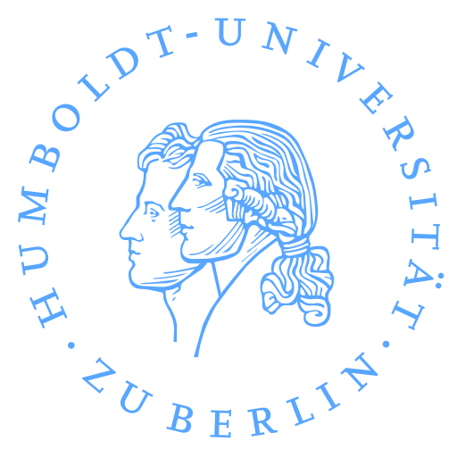

# Hi Hallo سلام 😊👋

<a href="https://github.com/MohammadMahdiJavid">
  Student @ Humboldt-Universität zu Berlin
  
    
</a>

  
  &nbsp;
  
  

* ✏️ Python / C# / JS
* 🛠️ Linux forever

### More information

* **Homepage** <https://MohammadMahdiJavid.ir>
* **About me** I'm a Security Geek 🐧, who loves Linux and Microcontrollers 🔧⚡

### Let's Connect ☕

### TryHackMe

